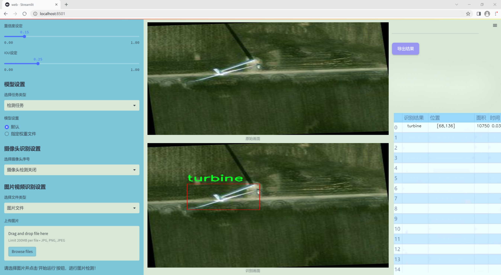

### 1.背景意义

研究背景与意义

随着全球对可再生能源的日益重视，风能作为一种清洁、可再生的能源形式，得到了广泛的应用。风力涡轮机作为风能转化的核心设备，其数量和规模的不断扩大，使得对风力涡轮机的监测与管理变得尤为重要。传统的人工巡检方式不仅耗时耗力，而且容易受到天气、环境等因素的影响，导致检测效率低下和准确性不足。因此，基于计算机视觉的自动化检测系统应运而生，成为提升风力涡轮机监测效率的重要手段。

在这一背景下，YOLO（You Only Look Once）系列模型因其高效的实时目标检测能力而受到广泛关注。特别是YOLOv11，作为最新版本，结合了深度学习的先进技术，具备更强的特征提取能力和更快的推理速度，适合在复杂环境中进行风力涡轮机的检测。然而，现有的YOLOv11模型在特定应用场景下仍存在一些局限性，如对小目标的检测能力不足、对不同光照条件的适应性差等。因此，改进YOLOv11模型以提高其在风力涡轮机检测中的性能，具有重要的理论价值和实际意义。

本研究将基于368幅风力涡轮机的高空图像数据集，针对YOLOv11模型进行改进，旨在提升其在风力涡轮机检测中的准确性和鲁棒性。通过引入数据增强技术、优化网络结构以及调整损失函数等手段，期望能够有效提高模型对风力涡轮机的检测精度和实时性，从而为风力发电行业的智能化管理提供有力支持。这不仅能够降低人工巡检的成本，提高检测效率，还能为风力涡轮机的安全运行提供保障，推动可再生能源的可持续发展。

### 2.视频效果

[2.1 视频效果](https://www.bilibili.com/video/BV1wiDzYJEkA/)

### 3.图片效果




##### [项目涉及的源码数据来源链接](https://kdocs.cn/l/cszuIiCKVNis)**

注意：本项目提供训练的数据集和训练教程,由于版本持续更新,暂不提供权重文件（best.pt）,请按照6.训练教程进行训练后实现上图演示的效果。

### 4.数据集信息

##### 4.1 本项目数据集类别数＆类别名

nc: 1
names: ['turbine']


该项目为【目标检测】数据集，请在【训练教程和Web端加载模型教程（第三步）】这一步的时候按照【目标检测】部分的教程来训练

##### 4.2 本项目数据集信息介绍

本项目数据集信息介绍

本项目所使用的数据集名为“Wind Turbines detection from Overhead Images”，旨在为改进YOLOv11的风力涡轮机检测系统提供高质量的训练数据。该数据集专注于从高空图像中识别和定位风力涡轮机，具有重要的实际应用价值，尤其是在可再生能源领域。数据集中包含了丰富的风力涡轮机图像，所有图像均为从高空拍摄，能够有效模拟真实环境中风力涡轮机的外观和布局。

该数据集的类别数量为1，具体类别为“turbine”，这意味着数据集专注于风力涡轮机的检测与识别。通过这种单一类别的设计，数据集能够更好地聚焦于风力涡轮机的特征提取，简化模型训练过程，同时提高检测精度。每张图像都经过精心标注，确保模型在训练过程中能够学习到风力涡轮机的各种形态、尺寸和背景变化。这种高质量的标注为模型的准确性和鲁棒性奠定了坚实的基础。

在数据集的构建过程中，考虑到了多样性和代表性，涵盖了不同环境条件下的风力涡轮机图像，包括晴天、阴天以及不同季节的场景。这种多样性不仅增强了模型的泛化能力，也使其在实际应用中能够更好地适应不同的检测场景。此外，数据集还包括了不同角度和距离拍摄的图像，以进一步提升模型对风力涡轮机的识别能力。

综上所述，“Wind Turbines detection from Overhead Images”数据集为本项目提供了一个全面且高效的训练基础，旨在通过改进YOLOv11算法，提升风力涡轮机的检测性能，推动可再生能源技术的发展。


### 5.全套项目环境部署视频教程（零基础手把手教学）

[5.1 所需软件PyCharm和Anaconda安装教程（第一步）](https://www.bilibili.com/video/BV1BoC1YCEKi/?spm_id_from=333.999.0.0&vd_source=bc9aec86d164b67a7004b996143742dc)


[5.2 安装Python虚拟环境创建和依赖库安装视频教程（第二步）](https://www.bilibili.com/video/BV1ZoC1YCEBw?spm_id_from=333.788.videopod.sections&vd_source=bc9aec86d164b67a7004b996143742dc)

### 6.改进YOLOv11训练教程和Web_UI前端加载模型教程（零基础手把手教学）

[6.1 改进YOLOv11训练教程和Web_UI前端加载模型教程（第三步）](https://www.bilibili.com/video/BV1BoC1YCEhR?spm_id_from=333.788.videopod.sections&vd_source=bc9aec86d164b67a7004b996143742dc)


按照上面的训练视频教程链接加载项目提供的数据集，运行train.py即可开始训练



     Epoch   gpu_mem       box       obj       cls    labels  img_size
     1/200     20.8G   0.01576   0.01955  0.007536        22      1280: 100%|██████████| 849/849 [14:42<00:00,  1.04s/it]
               Class     Images     Labels          P          R     mAP@.5 mAP@.5:.95: 100%|██████████| 213/213 [01:14<00:00,  2.87it/s]
                 all       3395      17314      0.994      0.957      0.0957      0.0843

     Epoch   gpu_mem       box       obj       cls    labels  img_size
     2/200     20.8G   0.01578   0.01923  0.007006        22      1280: 100%|██████████| 849/849 [14:44<00:00,  1.04s/it]
               Class     Images     Labels          P          R     mAP@.5 mAP@.5:.95: 100%|██████████| 213/213 [01:12<00:00,  2.95it/s]
                 all       3395      17314      0.996      0.956      0.0957      0.0845

     Epoch   gpu_mem       box       obj       cls    labels  img_size
     3/200     20.8G   0.01561    0.0191  0.006895        27      1280: 100%|██████████| 849/849 [10:56<00:00,  1.29it/s]
               Class     Images     Labels          P          R     mAP@.5 mAP@.5:.95: 100%|███████   | 187/213 [00:52<00:00,  4.04it/s]
                 all       3395      17314      0.996      0.957      0.0957      0.0845


###### [项目数据集下载链接](https://kdocs.cn/l/cszuIiCKVNis)

### 7.原始YOLOv11算法讲解


##### YOLO11介绍

Ultralytics YOLO11是一款尖端的、最先进的模型，它在之前YOLO版本成功的基础上进行了构建，并引入了新功能和改进，以进一步提升性能和灵活性。
**YOLO11设计快速、准确且易于使用，使其成为各种物体检测和跟踪、实例分割、图像分类以及姿态估计任务的绝佳选择。**


**结构图如下：**


##### **C3k2**

**C3k2，结构图如下**


**C3k2，继承自类`C2f，其中通过c3k设置False或者Ture来决定选择使用C3k还是`**Bottleneck


**实现代码** **ultralytics/nn/modules/block.py**

##### C2PSA介绍

**借鉴V10 PSA结构，实现了C2PSA和C2fPSA，最终选择了基于C2的C2PSA（可能涨点更好？）**


**实现代码** **ultralytics/nn/modules/block.py**

##### Detect介绍

**分类检测头引入了DWConv（更加轻量级，为后续二次创新提供了改进点），结构图如下（和V8的区别）：**


### 8.200+种全套改进YOLOV11创新点原理讲解

#### 8.1 200+种全套改进YOLOV11创新点原理讲解大全

由于篇幅限制，每个创新点的具体原理讲解就不全部展开，具体见下列网址中的改进模块对应项目的技术原理博客网址【Blog】（创新点均为模块化搭建，原理适配YOLOv5~YOLOv11等各种版本）

[改进模块技术原理博客【Blog】网址链接](https://gitee.com/qunmasj/good)


#### 8.2 精选部分改进YOLOV11创新点原理讲解

###### 这里节选部分改进创新点展开原理讲解(完整的改进原理见上图和[改进模块技术原理博客链接](https://gitee.com/qunmasj/good)【如果此小节的图加载失败可以通过CSDN或者Github搜索该博客的标题访问原始博客，原始博客图片显示正常】


#### 特征融合

模型架构图如下

  Darknet-53的特点可以这样概括：（Conv卷积模块+Residual Block残差块）串行叠加4次

  Conv卷积层+Residual Block残差网络就被称为一个stage


上面红色指出的那个，原始的Darknet-53里面有一层 卷积，在YOLOv11里面，把一层卷积移除了

为什么移除呢？

        原始Darknet-53模型中间加的这个卷积层做了什么？滤波器（卷积核）的个数从 上一个卷积层的512个，先增加到1024个卷积核，然后下一层卷积的卷积核的个数又降低到512个

        移除掉这一层以后，少了1024个卷积核，就可以少做1024次卷积运算，同时也少了1024个3×3的卷积核的参数，也就是少了9×1024个参数需要拟合。这样可以大大减少了模型的参数，（相当于做了轻量化吧）

        移除掉这个卷积层，可能是因为作者发现移除掉这个卷积层以后，模型的score有所提升，所以才移除掉的。为什么移除掉以后，分数有所提高呢？可能是因为多了这些参数就容易，参数过多导致模型在训练集删过拟合，但是在测试集上表现很差，最终模型的分数比较低。你移除掉这个卷积层以后，参数减少了，过拟合现象不那么严重了，泛化能力增强了。当然这个是，拿着你做实验的结论，反过来再找补，再去强行解释这种现象的合理性。


通过MMdetection官方绘制册这个图我们可以看到，进来的这张图片经过一个“Feature Pyramid Network(简称FPN)”，然后最后的P3、P4、P5传递给下一层的Neck和Head去做识别任务。 PAN（Path Aggregation Network）


“FPN是自顶向下，将高层的强语义特征传递下来。PAN就是在FPN的后面添加一个自底向上的金字塔，对FPN补充，将低层的强定位特征传递上去，

FPN是自顶（小尺寸，卷积次数多得到的结果，语义信息丰富）向下（大尺寸，卷积次数少得到的结果），将高层的强语义特征传递下来，对整个金字塔进行增强，不过只增强了语义信息，对定位信息没有传递。PAN就是针对这一点，在FPN的后面添加一个自底（卷积次数少，大尺寸）向上（卷积次数多，小尺寸，语义信息丰富）的金字塔，对FPN补充，将低层的强定位特征传递上去，又被称之为“双塔战术”。

FPN层自顶向下传达强语义特征，而特征金字塔则自底向上传达强定位特征，两两联手，从不同的主干层对不同的检测层进行参数聚合,这样的操作确实很皮。
#### 自底向上增强


而 PAN（Path Aggregation Network）是对 FPN 的一种改进，它的设计理念是在 FPN 后面添加一个自底向上的金字塔。PAN 引入了路径聚合的方式，通过将浅层特征图（低分辨率但语义信息较弱）和深层特征图（高分辨率但语义信息丰富）进行聚合，并沿着特定的路径传递特征信息，将低层的强定位特征传递上去。这样的操作能够进一步增强多尺度特征的表达能力，使得 PAN 在目标检测任务中表现更加优秀。


### Gold-YOLO简介
YOLO系列模型面世至今已有8年，由于其优异的性能，已成为目标检测领域的标杆。在系列模型经过十多个不同版本的改进发展逐渐稳定完善的今天，研究人员更多关注于单个计算模块内结构的精细调整，或是head部分和训练方法上的改进。但这并不意味着现有模式已是最优解。

当前YOLO系列模型通常采用类FPN方法进行信息融合，而这一结构在融合跨层信息时存在信息损失的问题。针对这一问题，我们提出了全新的信息聚集-分发（Gather-and-Distribute Mechanism）GD机制，通过在全局视野上对不同层级的特征进行统一的聚集融合并分发注入到不同层级中，构建更加充分高效的信息交互融合机制，并基于GD机制构建了Gold-YOLO。在COCO数据集中，我们的Gold-YOLO超越了现有的YOLO系列，实现了精度-速度曲线上的SOTA。


精度和速度曲线（TensorRT7）


精度和速度曲线（TensorRT8）
传统YOLO的问题
在检测模型中，通常先经过backbone提取得到一系列不同层级的特征，FPN利用了backbone的这一特点，构建了相应的融合结构：不层级的特征包含着不同大小物体的位置信息，虽然这些特征包含的信息不同，但这些特征在相互融合后能够互相弥补彼此缺失的信息，增强每一层级信息的丰富程度，提升网络性能。

原始的FPN结构由于其层层递进的信息融合模式，使得相邻层的信息能够充分融合，但也导致了跨层信息融合存在问题：当跨层的信息进行交互融合时，由于没有直连的交互通路，只能依靠中间层充当“中介”进行融合，导致了一定的信息损失。之前的许多工作中都关注到了这一问题，而解决方案通常是通过添加shortcut增加更多的路径，以增强信息流动。

然而传统的FPN结构即便改进后，由于网络中路径过多，且交互方式不直接，基于FPN思想的信息融合结构仍然存在跨层信息交互困难和信息损失的问题。

#### Gold-YOLO：全新的信息融合交互机制


#### Gold-YOLO架构
参考该博客提出的一种全新的信息交互融合机制：信息聚集-分发机制(Gather-and-Distribute Mechanism)。该机制通过在全局上融合不同层次的特征得到全局信息，并将全局信息注入到不同层级的特征中，实现了高效的信息交互和融合。在不显著增加延迟的情况下GD机制显著增强了Neck部分的信息融合能力，提高了模型对不同大小物体的检测能力。

GD机制通过三个模块实现：信息对齐模块(FAM)、信息融合模块(IFM)和信息注入模块(Inject)。

信息对齐模块负责收集并对齐不同层级不同大小的特征

信息融合模块通过使用卷积或Transformer算子对对齐后的的特征进行融合，得到全局信息

信息注入模块将全局信息注入到不同层级中

在Gold-YOLO中，针对模型需要检测不同大小的物体的需要，并权衡精度和速度，我们构建了两个GD分支对信息进行融合：低层级信息聚集-分发分支(Low-GD)和高层级信息聚集-分发分支(High-GD)，分别基于卷积和transformer提取和融合特征信息。

此外,为了促进局部信息的流动，我们借鉴现有工作，构建了一个轻量级的邻接层融合模块，该模块在局部尺度上结合了邻近层的特征，进一步提升了模型性能。我们还引入并验证了预训练方法对YOLO模型的有效性，通过在ImageNet 1K上使用MAE方法对主干进行预训练，显著提高了模型的收敛速度和精度。


### 9.系统功能展示

图9.1.系统支持检测结果表格显示

  图9.2.系统支持置信度和IOU阈值手动调节

  图9.3.系统支持自定义加载权重文件best.pt(需要你通过步骤5中训练获得)

  图9.4.系统支持摄像头实时识别

  图9.5.系统支持图片识别

  图9.6.系统支持视频识别

  图9.7.系统支持识别结果文件自动保存

  图9.8.系统支持Excel导出检测结果数据


### 10. YOLOv11核心改进源码讲解

#### 10.1 mamba_vss.py

以下是代码中最核心的部分，并附上详细的中文注释：

```python
import torch
import torch.nn as nn
import torch.nn.functional as F
from einops import repeat
from functools import partial

class SS2D(nn.Module):
    def __init__(self, d_model, d_state=16, d_conv=3, expand=2, dropout=0., device=None, dtype=None):
        super().__init__()
        self.d_model = d_model  # 输入特征的维度
        self.d_state = d_state  # 状态的维度
        self.d_conv = d_conv  # 卷积核的大小
        self.expand = expand  # 扩展因子
        self.d_inner = int(self.expand * self.d_model)  # 内部特征维度

        # 输入线性变换，将输入特征映射到内部特征空间
        self.in_proj = nn.Linear(self.d_model, self.d_inner * 2)

        # 2D卷积层，进行特征提取
        self.conv2d = nn.Conv2d(
            in_channels=self.d_inner,
            out_channels=self.d_inner,
            groups=self.d_inner,
            kernel_size=d_conv,
            padding=(d_conv - 1) // 2,
        )
        self.act = nn.SiLU()  # 激活函数

        # 状态和其他参数的线性变换
        self.x_proj_weight = nn.Parameter(torch.empty(4, self.d_inner, self.d_state * 2))  # 权重参数
        self.dt_projs_weight = nn.Parameter(torch.empty(4, self.d_inner, self.d_state))  # dt投影权重
        self.dt_projs_bias = nn.Parameter(torch.empty(4, self.d_inner))  # dt投影偏置

        # 初始化状态参数
        self.A_logs = self.A_log_init(self.d_state, self.d_inner, copies=4)  # A参数
        self.Ds = self.D_init(self.d_inner, copies=4)  # D参数

        self.out_norm = nn.LayerNorm(self.d_inner)  # 输出归一化层
        self.out_proj = nn.Linear(self.d_inner, self.d_model)  # 输出线性变换
        self.dropout = nn.Dropout(dropout) if dropout > 0. else None  # dropout层

    @staticmethod
    def A_log_init(d_state, d_inner, copies=1):
        # 初始化A参数
        A = repeat(torch.arange(1, d_state + 1, dtype=torch.float32), "n -> d n", d=d_inner)
        A_log = torch.log(A)  # 取对数
        A_log = nn.Parameter(A_log)  # 转换为可训练参数
        return A_log

    @staticmethod
    def D_init(d_inner, copies=1):
        # 初始化D参数
        D = torch.ones(d_inner)
        D = nn.Parameter(D)  # 转换为可训练参数
        return D

    def forward_core(self, x: torch.Tensor):
        # 核心前向传播逻辑
        B, C, H, W = x.shape  # 获取输入的形状
        L = H * W  # 计算总的空间维度

        # 进行特征变换
        x_dbl = torch.einsum("b c h w -> b (c h w)", x)  # 展平
        dts, Bs, Cs = torch.split(x_dbl, [self.d_state, self.d_state, self.d_state], dim=1)  # 分割

        # 计算输出
        out_y = self.selective_scan(x, dts, Bs, Cs, self.Ds)  # 选择性扫描
        y = self.out_norm(out_y)  # 归一化
        return y

    def forward(self, x: torch.Tensor):
        # 前向传播
        xz = self.in_proj(x)  # 输入线性变换
        x, z = xz.chunk(2, dim=-1)  # 分割
        x = x.permute(0, 3, 1, 2)  # 调整维度
        x = self.act(self.conv2d(x))  # 卷积和激活
        y = self.forward_core(x)  # 核心前向传播
        y = y * F.silu(z)  # 加权
        out = self.out_proj(y)  # 输出变换
        if self.dropout is not None:
            out = self.dropout(out)  # 应用dropout
        return out

class VSSBlock(nn.Module):
    def __init__(self, hidden_dim: int = 0, drop_path: float = 0.2, d_state: int = 16):
        super().__init__()
        self.ln_1 = nn.LayerNorm(hidden_dim)  # 归一化层
        self.self_attention = SS2D(d_model=hidden_dim, d_state=d_state)  # 自注意力层
        self.drop_path = nn.Dropout(drop_path)  # 随机丢弃路径

    def forward(self, input: torch.Tensor):
        input = input.permute((0, 2, 3, 1))  # 调整输入维度
        x = input + self.drop_path(self.self_attention(self.ln_1(input)))  # 残差连接
        return x.permute((0, 3, 1, 2))  # 调整输出维度

# 这里省略了 Mamba2Block 的实现，因为它只是 VSSBlock 的一个扩展
```

### 代码核心部分分析：
1. **SS2D 类**：这是一个自定义的神经网络模块，主要用于实现特征的自注意力机制。它包含了输入线性变换、卷积层、状态参数的初始化和前向传播逻辑。
2. **VSSBlock 类**：这是一个包含自注意力机制的模块，利用 `SS2D` 进行特征提取，并结合残差连接和归一化层。
3. **前向传播逻辑**：在 `forward` 方法中，输入经过线性变换、卷积、激活函数处理后，进入核心前向传播逻辑，最后通过输出线性变换得到最终结果。

这些部分是实现自注意力机制和特征提取的关键，理解这些代码有助于掌握深度学习中的注意力机制。

该文件 `mamba_vss.py` 定义了几个神经网络模块，主要是用于实现一种名为 VSS（Variable State Space）的自注意力机制，结合了卷积和线性变换的特性。文件中包含了两个主要的类：`SS2D` 和 `VSSBlock`，以及一个继承自 `VSSBlock` 的 `Mamba2Block` 类。

首先，`SS2D` 类是一个自定义的神经网络模块，继承自 `nn.Module`。它的构造函数接收多个参数，包括模型的维度、状态维度、卷积核大小、扩展因子等。该类的主要功能是通过一系列线性变换和卷积操作来处理输入数据。构造函数中定义了多个线性层和卷积层，用于对输入进行投影和特征提取。

在 `SS2D` 中，`dt_init` 方法用于初始化一个线性层，专门用于处理时间步长的投影，确保在初始化时保持方差。`A_log_init` 和 `D_init` 方法则用于初始化一些参数，这些参数在后续的前向传播中会被使用。`forward_corev0` 方法实现了核心的前向传播逻辑，使用了选择性扫描的函数来处理输入，生成输出特征。

`forward` 方法是 `SS2D` 的前向传播入口，接收输入张量并经过一系列的线性变换、卷积操作和激活函数处理，最终输出经过层归一化的结果。

接下来，`VSSBlock` 类同样继承自 `nn.Module`，它在构造函数中初始化了一个层归一化模块和一个 `SS2D` 自注意力模块。`drop_path` 是一种正则化技术，用于在训练过程中随机丢弃一些路径以防止过拟合。在 `forward` 方法中，输入数据经过层归一化和自注意力模块处理后，与原始输入相加，形成残差连接。

最后，`Mamba2Block` 类继承自 `VSSBlock`，并重写了自注意力模块为 `Mamba2Simple`，这表明该模块可能实现了另一种自注意力机制。它的前向传播逻辑与 `VSSBlock` 类似，处理输入并生成输出。

在文件的最后部分，包含了一些测试代码，用于创建输入张量并实例化 `VSSBlock` 和 `Mamba2Block`，然后进行前向传播，输出预测结果的尺寸。这部分代码主要用于验证模型的构建是否正确。

整体来看，该文件实现了一个基于自注意力机制的深度学习模块，结合了卷积和线性变换的特性，适用于处理图像等高维数据。

#### 10.2 prepbn.py

以下是经过简化和注释的核心代码部分：

```python
import torch
import torch.nn as nn

# 自定义的批归一化层，包含一个可学习的参数 alpha
class RepBN(nn.Module):
    def __init__(self, channels):
        super(RepBN, self).__init__()
        # 初始化可学习参数 alpha，初始值为 1
        self.alpha = nn.Parameter(torch.ones(1))
        # 初始化一维批归一化层
        self.bn = nn.BatchNorm1d(channels)

    def forward(self, x):
        # 将输入的维度进行转置，以适应 BatchNorm1d 的输入格式
        x = x.transpose(1, 2)
        # 进行批归一化，并加上 alpha 乘以输入 x
        x = self.bn(x) + self.alpha * x
        # 再次转置回原来的维度
        x = x.transpose(1, 2)
        return x

# 自定义的线性归一化层，结合了两个归一化方法
class LinearNorm(nn.Module):
    def __init__(self, dim, norm1, norm2, warm=0, step=300000, r0=1.0):
        super(LinearNorm, self).__init__()
        # 注册缓冲区，用于存储暖身期和迭代次数
        self.register_buffer('warm', torch.tensor(warm))
        self.register_buffer('iter', torch.tensor(step))
        self.register_buffer('total_step', torch.tensor(step))
        self.r0 = r0  # 初始比例因子
        # 初始化两个归一化方法
        self.norm1 = norm1(dim)
        self.norm2 = norm2(dim)

    def forward(self, x):
        if self.training:  # 仅在训练模式下执行以下逻辑
            if self.warm > 0:  # 如果处于暖身阶段
                self.warm.copy_(self.warm - 1)  # 减少暖身计数
                x = self.norm1(x)  # 使用第一个归一化方法
            else:
                # 计算当前的比例因子 lamda
                lamda = self.r0 * self.iter / self.total_step
                if self.iter > 0:
                    self.iter.copy_(self.iter - 1)  # 减少迭代计数
                # 使用两个归一化方法进行处理
                x1 = self.norm1(x)
                x2 = self.norm2(x)
                # 线性组合两个归一化的结果
                x = lamda * x1 + (1 - lamda) * x2
        else:
            # 在评估模式下，直接使用第二个归一化方法
            x = self.norm2(x)
        return x
```

### 代码注释说明：
1. **RepBN 类**：实现了一个自定义的批归一化层，除了常规的批归一化外，还引入了一个可学习的参数 `alpha`，用于调整输入的影响。
2. **LinearNorm 类**：结合了两种归一化方法，并根据训练的进度动态调整它们的权重。使用暖身期（warm-up）来逐步引入归一化，之后根据迭代次数调整归一化的比例。

这个程序文件定义了两个神经网络模块，分别是 `RepBN` 和 `LinearNorm`，它们都继承自 PyTorch 的 `nn.Module` 类。

`RepBN` 类实现了一种新的归一化方法。它的构造函数接受一个参数 `channels`，用于指定输入数据的通道数。在初始化时，它创建了一个可学习的参数 `alpha`，并实例化了一个一维批量归一化层 `bn`。在 `forward` 方法中，输入张量 `x` 首先进行维度转置，将通道维度移到最后，然后通过批量归一化层进行处理，最后将归一化后的结果与原始输入乘以 `alpha` 相加，再次进行维度转置以恢复原来的形状。这个过程可以增强模型的表达能力，因为它结合了标准的批量归一化和输入的线性变换。

`LinearNorm` 类则实现了一种动态的归一化策略。它的构造函数接受多个参数，包括维度 `dim`、两个归一化方法 `norm1` 和 `norm2`，以及一些控制训练过程的参数如 `warm`、`step` 和 `r0`。在初始化时，它将这些参数注册为缓冲区，以便在训练过程中保持状态。在 `forward` 方法中，首先检查模型是否处于训练模式。如果是，并且 `warm` 大于零，则会减少 `warm` 的值并应用 `norm1` 进行归一化。如果 `warm` 为零，则根据当前的迭代次数计算一个动态的权重 `lamda`，并使用 `norm1` 和 `norm2` 对输入进行归一化，最终根据 `lamda` 的值加权组合这两个归一化结果。如果模型不在训练模式下，则直接使用 `norm2` 对输入进行归一化。

总体而言，这两个模块提供了灵活的归一化机制，能够在不同的训练阶段和模式下调整模型的行为，从而提高模型的性能和稳定性。

#### 10.3 hcfnet.py

以下是代码中最核心的部分，并附上详细的中文注释：

```python
import torch
import torch.nn as nn
import torch.nn.functional as F

class SpatialAttentionModule(nn.Module):
    def __init__(self):
        super(SpatialAttentionModule, self).__init__()
        # 定义一个卷积层，用于生成空间注意力图
        self.conv2d = nn.Conv2d(in_channels=2, out_channels=1, kernel_size=7, stride=1, padding=3)
        self.sigmoid = nn.Sigmoid()  # 使用Sigmoid激活函数将输出限制在0到1之间

    def forward(self, x):
        # 计算输入特征图的平均值和最大值
        avgout = torch.mean(x, dim=1, keepdim=True)  # 沿通道维度计算平均值
        maxout, _ = torch.max(x, dim=1, keepdim=True)  # 沿通道维度计算最大值
        out = torch.cat([avgout, maxout], dim=1)  # 将平均值和最大值拼接在一起
        out = self.sigmoid(self.conv2d(out))  # 通过卷积层和Sigmoid激活函数生成注意力图
        return out * x  # 将注意力图与输入特征图相乘，得到加权后的特征图

class LocalGlobalAttention(nn.Module):
    def __init__(self, output_dim, patch_size):
        super().__init__()
        self.output_dim = output_dim
        self.patch_size = patch_size
        # 定义多层感知机(MLP)和层归一化
        self.mlp1 = nn.Linear(patch_size * patch_size, output_dim // 2)
        self.norm = nn.LayerNorm(output_dim // 2)
        self.mlp2 = nn.Linear(output_dim // 2, output_dim)
        self.conv = nn.Conv2d(output_dim, output_dim, kernel_size=1)  # 1x1卷积层用于调整输出通道

    def forward(self, x):
        x = x.permute(0, 2, 3, 1)  # 调整输入张量的维度顺序
        B, H, W, C = x.shape  # 获取批量大小、高度、宽度和通道数
        P = self.patch_size

        # 提取局部特征
        local_patches = x.unfold(1, P, P).unfold(2, P, P)  # 提取局部补丁
        local_patches = local_patches.reshape(B, -1, P * P, C)  # 重塑形状
        local_patches = local_patches.mean(dim=-1)  # 沿通道维度计算平均值

        # 通过MLP处理局部特征
        local_patches = self.mlp1(local_patches)  # 第一层MLP
        local_patches = self.norm(local_patches)  # 层归一化
        local_patches = self.mlp2(local_patches)  # 第二层MLP

        local_attention = F.softmax(local_patches, dim=-1)  # 计算局部注意力
        local_out = local_patches * local_attention  # 加权局部特征

        # 处理局部特征与提示向量的相似度
        cos_sim = F.normalize(local_out, dim=-1) @ F.normalize(self.prompt[None, ..., None], dim=1)  # 计算余弦相似度
        mask = cos_sim.clamp(0, 1)  # 限制相似度在0到1之间
        local_out = local_out * mask  # 应用掩码
        local_out = local_out @ self.top_down_transform  # 应用变换

        # 恢复形状并输出
        local_out = local_out.reshape(B, H // P, W // P, self.output_dim)  # 恢复到原始形状
        local_out = local_out.permute(0, 3, 1, 2)  # 调整维度顺序
        local_out = F.interpolate(local_out, size=(H, W), mode='bilinear', align_corners=False)  # 上采样
        output = self.conv(local_out)  # 通过卷积层得到最终输出

        return output

class PPA(nn.Module):
    def __init__(self, in_features, filters) -> None:
        super().__init__()
        # 定义各个卷积层和注意力模块
        self.skip = nn.Conv2d(in_features, filters, kernel_size=1, stride=1)
        self.c1 = nn.Conv2d(filters, filters, kernel_size=3, padding=1)
        self.c2 = nn.Conv2d(filters, filters, kernel_size=3, padding=1)
        self.c3 = nn.Conv2d(filters, filters, kernel_size=3, padding=1)
        self.sa = SpatialAttentionModule()  # 空间注意力模块
        self.lga2 = LocalGlobalAttention(filters, 2)  # 局部全局注意力模块
        self.lga4 = LocalGlobalAttention(filters, 4)  # 局部全局注意力模块

    def forward(self, x):
        x_skip = self.skip(x)  # 跳跃连接
        x_lga2 = self.lga2(x_skip)  # 计算局部全局注意力
        x_lga4 = self.lga4(x_skip)  # 计算局部全局注意力
        x1 = self.c1(x)  # 通过卷积层处理输入
        x2 = self.c2(x1)  # 通过卷积层处理
        x3 = self.c3(x2)  # 通过卷积层处理
        # 将所有特征相加
        x = x1 + x2 + x3 + x_skip + x_lga2 + x_lga4
        x = self.sa(x)  # 应用空间注意力
        return x  # 返回最终输出
```

以上代码包含了空间注意力模块、局部全局注意力模块和PPA模块的核心实现，注释详细解释了每个部分的功能和作用。

这个程序文件 `hcfnet.py` 定义了一些用于深度学习的模块，主要用于图像处理和特征提取。代码中包含多个类，每个类实现了特定的功能，以下是对代码的详细说明。

首先，导入了必要的库，包括 `math`、`torch` 及其子模块 `nn` 和 `functional`，以及自定义的 `Conv` 模块。`__all__` 列表定义了该模块公开的类名。

`SpatialAttentionModule` 类实现了空间注意力机制。其构造函数中定义了一个卷积层和一个 Sigmoid 激活函数。在前向传播中，首先计算输入特征图的平均值和最大值，然后将它们拼接在一起，经过卷积和 Sigmoid 激活后，得到的输出与输入特征图相乘，以增强重要特征。

`LocalGlobalAttention` 类实现了局部和全局注意力机制。构造函数中定义了多个线性层、卷积层和可学习的参数。在前向传播中，输入特征图被重排并分割成局部块，经过多层处理后，计算局部注意力并与输入特征图结合，最后通过上采样和卷积层输出结果。

`ECA` 类实现了有效通道注意力机制。通过自适应平均池化和一维卷积，计算通道的权重并应用于输入特征图。该机制通过动态调整卷积核大小来增强模型的表达能力。

`PPA` 类是一个复合模块，结合了多个卷积层、空间注意力和有效通道注意力。它在前向传播中对输入进行多次卷积处理，并结合局部全局注意力模块的输出，最后通过批归一化和激活函数处理后返回结果。

`Bag` 类实现了一个简单的加权融合机制，输入三个特征图，通过边缘注意力来加权组合这些特征图。

`DASI` 类是一个复杂的模块，结合了不同尺度的特征图。它在构造函数中定义了多个卷积层和跳跃连接。在前向传播中，根据输入特征图的不同尺度进行处理，利用 `Bag` 类进行特征融合，最后通过尾部卷积和激活函数输出结果。

整体来看，这个文件实现了一种基于注意力机制的深度学习模型，旨在提高图像特征提取的效果。通过局部和全局特征的结合，模型能够更好地捕捉图像中的重要信息。

#### 10.4 fadc.py

以下是经过简化和注释的核心代码部分，主要保留了 `OmniAttention` 和 `AdaptiveDilatedConv` 类的实现。代码中的注释详细解释了每个部分的功能和作用。

```python
import torch
import torch.nn as nn
import torch.nn.functional as F

class OmniAttention(nn.Module):
    def __init__(self, in_planes, out_planes, kernel_size, groups=1, reduction=0.0625, kernel_num=4, min_channel=16):
        super(OmniAttention, self).__init__()
        # 计算注意力通道数
        attention_channel = max(int(in_planes * reduction), min_channel)
        self.kernel_size = kernel_size
        self.kernel_num = kernel_num
        self.temperature = 1.0  # 温度参数，用于控制注意力的平滑程度

        # 定义平均池化层
        self.avgpool = nn.AdaptiveAvgPool2d(1)
        # 定义全连接层和批归一化层
        self.fc = nn.Conv2d(in_planes, attention_channel, 1, bias=False)
        self.bn = nn.BatchNorm2d(attention_channel)
        self.relu = nn.ReLU(inplace=True)

        # 定义通道注意力
        self.channel_fc = nn.Conv2d(attention_channel, in_planes, 1, bias=True)
        self.func_channel = self.get_channel_attention

        # 定义滤波器注意力
        if in_planes == groups and in_planes == out_planes:  # 深度卷积
            self.func_filter = self.skip
        else:
            self.filter_fc = nn.Conv2d(attention_channel, out_planes, 1, bias=True)
            self.func_filter = self.get_filter_attention

        # 定义空间注意力
        if kernel_size == 1:  # 点卷积
            self.func_spatial = self.skip
        else:
            self.spatial_fc = nn.Conv2d(attention_channel, kernel_size * kernel_size, 1, bias=True)
            self.func_spatial = self.get_spatial_attention

        # 定义核注意力
        if kernel_num == 1:
            self.func_kernel = self.skip
        else:
            self.kernel_fc = nn.Conv2d(attention_channel, kernel_num, 1, bias=True)
            self.func_kernel = self.get_kernel_attention

        self._initialize_weights()  # 初始化权重

    def _initialize_weights(self):
        # 权重初始化
        for m in self.modules():
            if isinstance(m, nn.Conv2d):
                nn.init.kaiming_normal_(m.weight, mode='fan_out', nonlinearity='relu')
                if m.bias is not None:
                    nn.init.constant_(m.bias, 0)
            if isinstance(m, nn.BatchNorm2d):
                nn.init.constant_(m.weight, 1)
                nn.init.constant_(m.bias, 0)

    def get_channel_attention(self, x):
        # 计算通道注意力
        channel_attention = torch.sigmoid(self.channel_fc(x).view(x.size(0), -1, 1, 1) / self.temperature)
        return channel_attention

    def get_filter_attention(self, x):
        # 计算滤波器注意力
        filter_attention = torch.sigmoid(self.filter_fc(x).view(x.size(0), -1, 1, 1) / self.temperature)
        return filter_attention

    def get_spatial_attention(self, x):
        # 计算空间注意力
        spatial_attention = self.spatial_fc(x).view(x.size(0), 1, 1, 1, self.kernel_size, self.kernel_size)
        spatial_attention = torch.sigmoid(spatial_attention / self.temperature)
        return spatial_attention

    def get_kernel_attention(self, x):
        # 计算核注意力
        kernel_attention = self.kernel_fc(x).view(x.size(0), -1, 1, 1, 1, 1)
        kernel_attention = F.softmax(kernel_attention / self.temperature, dim=1)
        return kernel_attention

    def forward(self, x):
        # 前向传播
        x = self.avgpool(x)  # 平均池化
        x = self.fc(x)  # 全连接层
        x = self.bn(x)  # 批归一化
        x = self.relu(x)  # 激活函数
        return self.func_channel(x), self.func_filter(x), self.func_spatial(x), self.func_kernel(x)

class AdaptiveDilatedConv(nn.Module):
    """自适应膨胀卷积层，封装了可调节的卷积操作。"""
    def __init__(self, in_channels, out_channels, kernel_size, stride=1, padding=0, dilation=1, groups=1, bias=True):
        super(AdaptiveDilatedConv, self).__init__()
        self.conv = nn.Conv2d(in_channels, out_channels, kernel_size, stride=stride, padding=padding, dilation=dilation, groups=groups, bias=bias)
        self.omni_attention = OmniAttention(in_channels, out_channels, kernel_size)  # 初始化OmniAttention

    def forward(self, x):
        # 前向传播
        attention_outputs = self.omni_attention(x)  # 计算注意力
        x = self.conv(x)  # 卷积操作
        # 根据注意力输出调整卷积结果
        return x * attention_outputs[0]  # 使用通道注意力调整输出
```

### 代码解释：
1. **OmniAttention 类**：
   - 该类实现了一个多种注意力机制的模块，包括通道注意力、滤波器注意力、空间注意力和核注意力。
   - 使用 `forward` 方法进行前向传播，计算不同类型的注意力。

2. **AdaptiveDilatedConv 类**：
   - 该类实现了一个自适应膨胀卷积层，结合了 `OmniAttention` 模块。
   - 在 `forward` 方法中，首先计算注意力，然后进行卷积操作，并根据注意力调整输出。

以上代码保留了核心功能并添加了详细注释，便于理解其工作原理。

这个程序文件 `fadc.py` 是一个使用 PyTorch 实现的深度学习模块，主要涉及自适应膨胀卷积（Adaptive Dilated Convolution）和频率选择机制。文件中包含多个类和函数，以下是对其主要部分的讲解。

首先，文件导入了必要的库，包括 PyTorch 和 NumPy。接着，定义了一个名为 `OmniAttention` 的类，该类实现了一种全局注意力机制。该类的构造函数接受多个参数，包括输入和输出通道数、卷积核大小、组数、通道数的减少比例等。它通过自适应平均池化、全连接层、批归一化和激活函数等构建了一个多层网络，用于计算通道、过滤器、空间和核的注意力。

`OmniAttention` 类的 `_initialize_weights` 方法用于初始化网络权重，使用 Kaiming 正态分布初始化卷积层的权重，并将偏置初始化为零。`forward` 方法实现了前向传播，计算输入张量的注意力。

接下来，定义了一个名为 `generate_laplacian_pyramid` 的函数，该函数用于生成拉普拉斯金字塔。该函数接受输入张量、金字塔层数、是否对齐大小和插值模式等参数。它通过逐层下采样和计算拉普拉斯差分来构建金字塔。

然后，定义了 `FrequencySelection` 类，它实现了频率选择机制。该类根据输入通道数和其他参数构建多个卷积层，用于选择不同频率的特征。它支持多种池化类型，包括平均池化和拉普拉斯池化。`forward` 方法根据不同的池化类型和频率选择机制处理输入数据。

`AdaptiveDilatedConv` 类是一个自适应膨胀卷积的封装，继承自 `ModulatedDeformConv2d`。该类的构造函数接受多个参数，包括输入输出通道、卷积核大小、步幅、填充方式等。它根据不同的参数配置初始化卷积层和偏移量卷积层，并在前向传播中计算卷积操作。

最后，`AdaptiveDilatedDWConv` 类是一个深度可分离的自适应膨胀卷积实现，支持不同的卷积核分解方式。该类的构造函数和前向传播方法与 `AdaptiveDilatedConv` 类类似，但它特别针对深度可分离卷积进行了优化。

整体而言，这个程序文件实现了一个复杂的卷积神经网络模块，结合了注意力机制和频率选择技术，适用于图像处理和计算机视觉任务。

### 11.完整训练+Web前端界面+200+种全套创新点源码、数据集获取


# [下载链接：https://mbd.pub/o/bread/Z5WZm5hx](https://mbd.pub/o/bread/Z5WZm5hx)